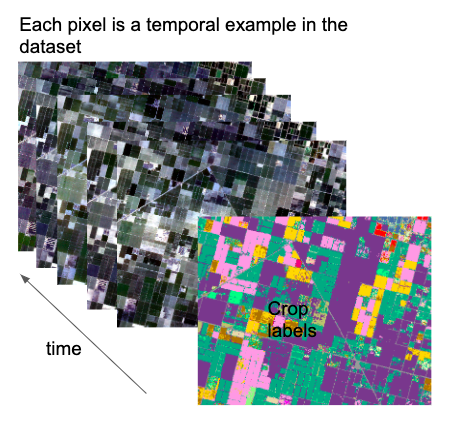

<div align="center">



# 🌾 Crop Classification
### Multi-Temporal Satellite Imagery · Deep Learning · RapidEye · USDA CDL

[](https://www.python.org/)
[](https://tensorflow.org)
[](LICENSE)
[]()

Classify crop types from sequences of satellite images using temporal deep learning.  
Rather than a single snapshot, the model learns each crop's unique **growth curve across an entire season**.

</div>

---

## 📖 Why temporal?

A field of grapes and a field of almonds can look nearly identical in early spring. Their spectral signatures diverge only as the season progresses — grapes leaf out later, almonds fruit earlier. Single-image classifiers miss this entirely.

This project stacks **10 multi-temporal RapidEye scenes** across a full 2017 growing season and trains models that see the complete phenological arc of each crop type, achieving ~95% accuracy with a Bidirectional LSTM.

---

## 🏗️ Architecture

Three models are provided, all trained on the same pipeline:

| Model | Input | How it works |
|-------|-------|-------------|
| **MLP** | `(T × F,)` flat vector | Fully-connected baseline; fast to train |
| **1-D CNN** | `(T, F)` sequence | Detects local temporal patterns via convolution |
| **BiLSTM** ⭐ | `(T, F)` sequence | Reads the sequence forward and backward; best captures crop phenology |

> **T = 10** timestamps · **F = 6** features per step (5 spectral bands + NDVI)

All models share:
- ✅ `StandardScaler` — fitted on training data only, persisted for inference
- ✅ Balanced class weights — handles the 13× pixel-count imbalance between classes
- ✅ `EarlyStopping` + `ReduceLROnPlateau` — no fixed epoch count
- ✅ Stratified train / val / test splits — **70 / 15 / 15**
- ✅ Per-class precision / recall / F1 + confusion matrix at evaluation

---

## 📡 Dataset

The dataset is assembled from two publicly accessible sources and is **not redistributed here**. You can recreate it yourself:

### Source 1 — Satellite imagery (Planet RapidEye)

10 scenes over a tile in **California's Central Valley**, 5 m resolution, 5 bands each:  
`Blue · Green · Red · Red-Edge · NIR`

<details>
<summary>View acquisition dates</summary>

| Date | Growing season stage |
|------|----------------------|
| 2017-03-06 | Early spring |
| 2017-04-10 | Green-up |
| 2017-06-01 | Early summer |
| 2017-06-15 | Peak growth begins |
| 2017-07-08 | Summer peak |
| 2017-08-07 | Late summer |
| 2017-09-05 | Senescence |
| 2017-09-23 | Late senescence |
| 2017-10-15 | Post-harvest |
| 2017-12-07 | Winter dormancy |

</details>

🔗 **Get the imagery:** Apply for Planet's free [Education & Research Program](https://www.planet.com/markets/education-and-research/), then download scenes via [Planet Explorer](https://www.planet.com/explorer/) or the [Planet Python SDK](https://github.com/planetlabs/planet-client-python).

### Source 2 — Ground-truth labels (USDA CDL 2017)

Pixel-level crop labels from the **USDA NASS Cropland Data Layer**, a free annually-updated land-cover raster at 30 m resolution.

🔗 **Get the labels:** [USDA NASS CropScape](https://nassgeodata.gmu.edu/CropScape/) → select year 2017 → draw your bounding box → export GeoTIFF.

**5 target classes** (top classes by pixel count in the study area):

| CDL Code | Crop | Pixel Count |
|----------|------|------------|
| 36 | Alfalfa | 1,543,068 |
| 69 | Grapes | 8,311,968 |
| 75 | Almonds | 4,729,104 |
| 121 | Developed / Open Space | 766,044 |
| 225 | Dbl Crop WinWht/Corn | 617,040 |

### Expected file layout

```
Dataset/
├── cdl2017.tiff        ← USDA CDL ground-truth labels
├── 20170306.tiff
├── 20170410.tiff
├── 20170601.tiff
├── 20170615.tiff
├── 20170708.tiff
├── 20170807.tiff
├── 20170905.tiff
├── 20170923.tiff
├── 20171015.tiff
└── 20171207.tiff
```

> Both rasters must share the same spatial extent and CRS.  
> Use `gdalwarp` to reproject/clip if needed.

---

## ⚙️ Installation

**Option A — Conda** (recommended, handles GDAL automatically)

```bash
conda env create -f environment.yml
conda activate crop-cls
```

**Option B — pip** (install GDAL via your system first)

```bash
pip install -r requirements.txt
```

> See [`GDAL_INSTALLATION.md`](GDAL_INSTALLATION.md) for platform-specific GDAL setup.

---

## 🚀 Quick Start

```bash
# 1. Build the pixel dataset from raw GeoTIFFs  (~500 MB output)
python scripts/preprocess.py

# 2. Train the recommended model (Bidirectional LSTM)
python scripts/train.py --model lstm

# 3. Run tests
pytest tests/ -v
```

### All training options

```bash
python scripts/train.py \
  --model     lstm   \   # mlp | cnn | lstm
  --epochs    50     \   # max epochs (EarlyStopping applies)
  --batch-size 256   \
  --test-size  0.15  \   # fraction held out for final evaluation
  --val-size   0.15  \   # fraction used during training validation
  --dropout    0.3
```

### Output files

After training, results are written to `models_saved/` and `results/`:

| File | Description |
|------|-------------|
| `models_saved/{model}_best.keras` | Best checkpoint by validation loss |
| `models_saved/{model}_final.keras` | Final model after all epochs |
| `models_saved/scaler.joblib` | Fitted `StandardScaler` (required for inference) |
| `models_saved/label_encoder.joblib` | Fitted `LabelEncoder` |
| `results/{model}_history.csv` | Per-epoch loss and accuracy |
| `results/{model}_report.txt` | Per-class precision / recall / F1 |
| `results/{model}_confusion_matrix.png` | Confusion matrix heatmap |
| `results/{model}_training_curve.png` | Loss and accuracy curves |

---

## 🗂️ Project Structure

```
Crop-Classification/
├── src/
│   ├── config.py        # paths, class labels, hyperparameter constants
│   ├── preprocess.py    # GeoTIFF → pixel CSV (with pixel-correspondence fix)
│   ├── features.py      # NDVI and spectral index computation
│   ├── models.py        # MLP, 1-D CNN, Bidirectional LSTM definitions
│   ├── train.py         # training pipeline
│   └── evaluate.py      # metrics, confusion matrix, training curves
├── scripts/
│   ├── preprocess.py    # CLI: build dataset
│   └── train.py         # CLI: train & evaluate
├── tests/
│   ├── test_features.py    # 7 unit tests
│   └── test_preprocess.py  # 4 unit tests (GDAL mocked)
├── Dataset/
│   └── download.txt     # data source instructions
├── environment.yml
├── requirements.txt
└── README.md
```

---

## 🐛 Key Fixes vs. Original Code

The original notebooks had several bugs that invalidated the results entirely:

| # | Issue | Original | Fixed |
|---|-------|----------|-------|
| 1 | **Pixel correspondence** 🔴 | Each timestamp sampled pixels independently — temporal sequences were spatially incoherent | Indices sampled once per class; identical pixel locations used across all timestamps |
| 2 | **Dropout rate** 🔴 | `Dropout(5)` — out of [0,1] range, undefined behaviour | `Dropout(0.3)` |
| 3 | **Evaluation** | Overall accuracy only | Per-class precision / recall / F1 + confusion matrix |
| 4 | **Class imbalance** | Not handled | Balanced class weights via `compute_class_weight` |
| 5 | **Scaler persistence** | Fitted then discarded | Saved to `models_saved/scaler.joblib` |
| 6 | **Training** | Fixed 10 epochs | `EarlyStopping` + `ModelCheckpoint` + `ReduceLROnPlateau` |
| 7 | **Model saving** | Model lost after training | Saved as `.keras` checkpoint |
| 8 | **Framework** | Standalone Keras 2 / TF 1.x (EOL) | TensorFlow 2.x / Keras 3 |
| 9 | **NDVI formula** | `(Blue − NIR) / (NIR + Blue)` — incorrect | Standard `(NIR − Red) / (NIR + Red)` |
| 10 | **Column naming** | Generic `col_0 … col_50` | Semantic `t{t}_b{b}` and `t{t}_ndvi` |

---

## 📚 Reference

> Rose M. Rustowicz et al., *Semantic Segmentation of Satellite Images Using Deep Learning*  
> Stanford CS229, 2017 — [Paper PDF](http://cs229.stanford.edu/proj2017/final-reports/5243811.pdf)
